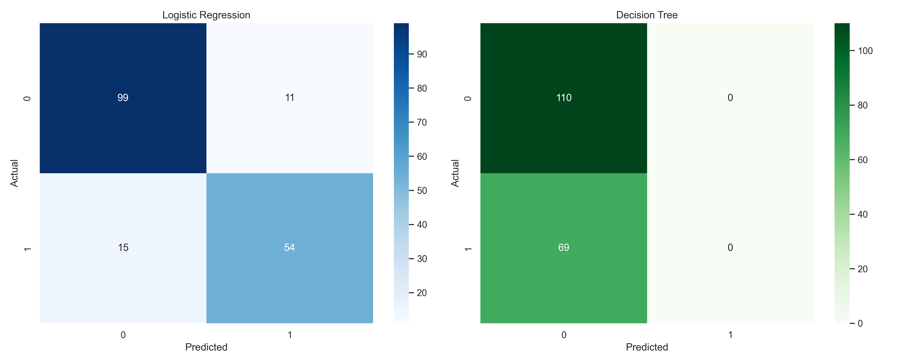
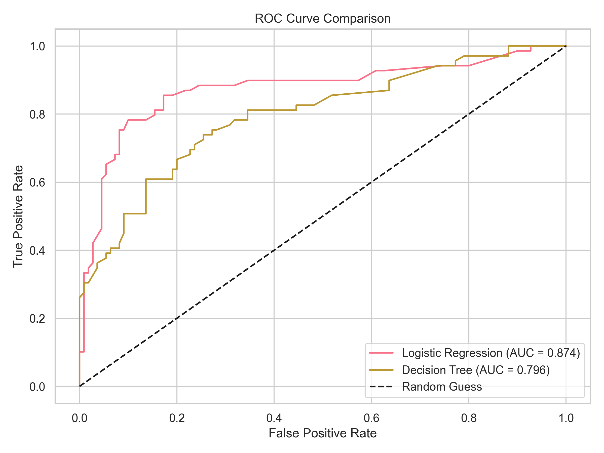
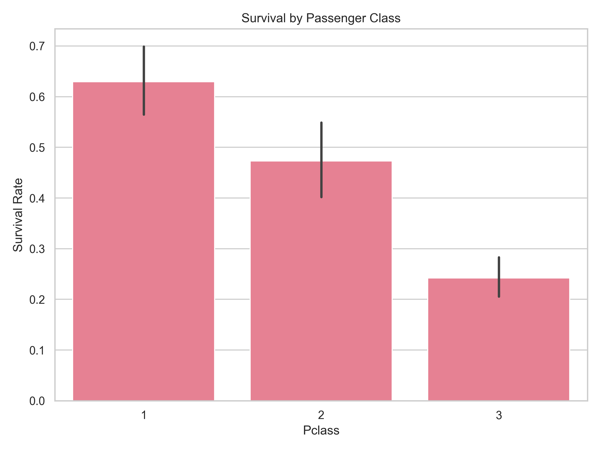
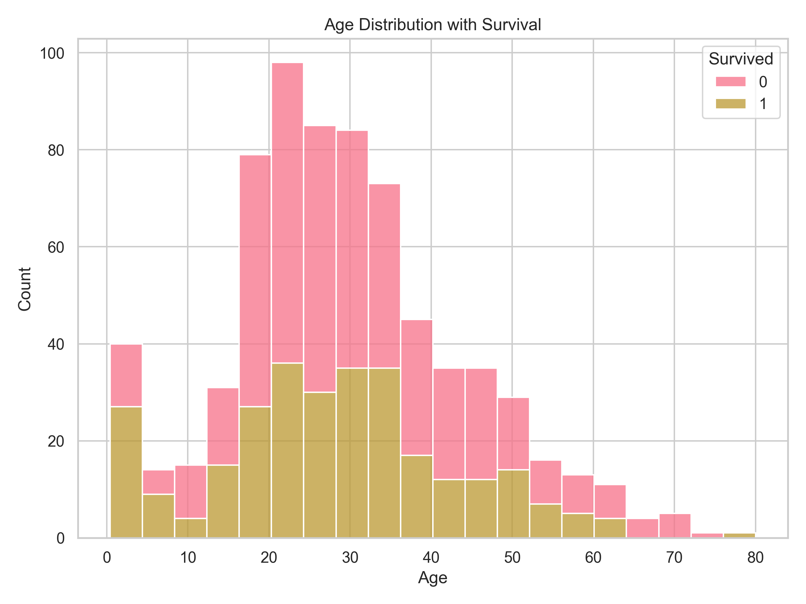
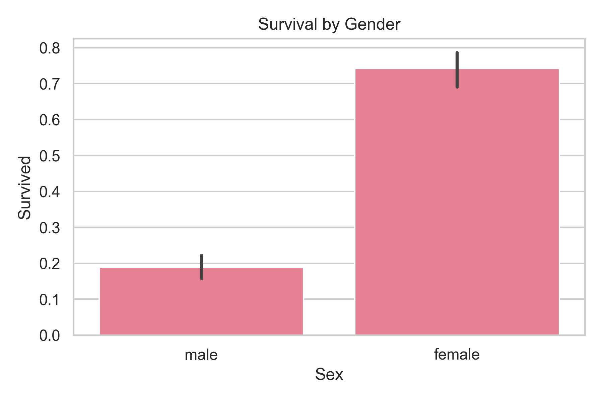
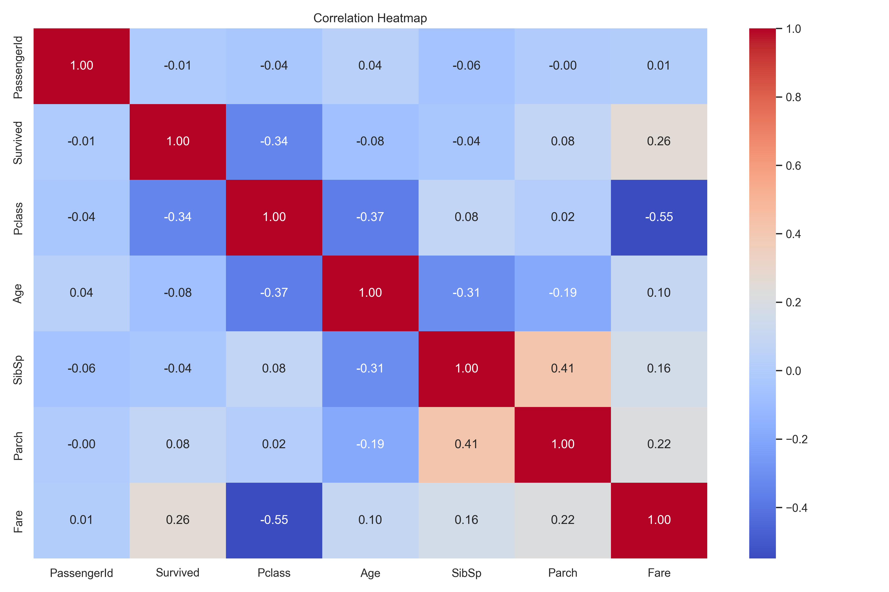
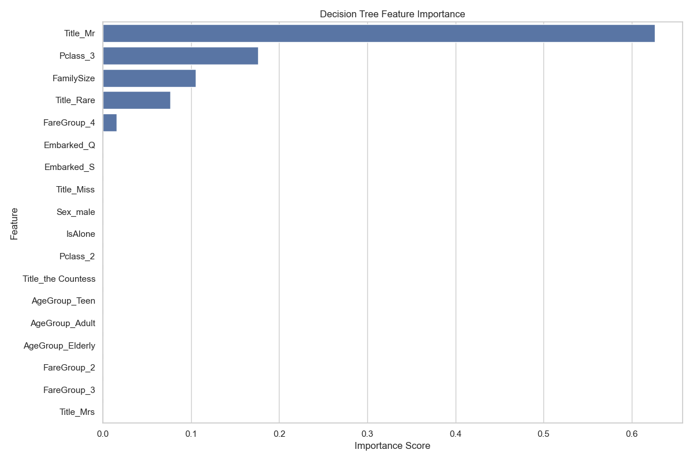

# Task-1  Titanic Survival Prediction 

## 📋 Project Overview

This project predicts passenger survival on the Titanic using machine learning classification techniques. It demonstrates the complete ML workflow from data preprocessing to model deployment.


---
## 🎯 Objectives Achieved
✅ Data cleaning and handling missing values

✅ Exploratory Data Analysis (EDA)

✅ Logistic Regression implementation

✅ Decision Trees with hyperparameter tuning

✅ Model evaluation and comparison

---
## 📊 Dataset
Source: Kaggle Titanic Competition

Training samples: 891 passengers

Test samples: 418 passengers

Features: 12 original features + engineered features

Target: Survival (0 = No, 1 = Yes)

---
## 📊 Generated Visualizations

The project includes several insightful visualizations that help understand the data patterns and model performance:

### 1. Model Performance Visualizations

#### Confusion Matrices

*Comparison of model performance through confusion matrices*

#### ROC Curves

*Receiver Operating Characteristic curves showing model performance*

### 2. Data Exploration Visualizations

#### Survival by Passenger Class

*Survival rates across different passenger classes*

#### Age Distribution

*Distribution of passenger ages with survival overlay*

#### Gender Survival Comparison

*Comparison of survival rates between male and female passengers*

#### Correlation Heatmap

*Correlation matrix showing relationships between features*

### 3. Feature Importance

*Relative importance of features in predicting survival*

---
## 🛠️ Technical Implementation

## Data Preprocessing
Missing values handled:

- Age: Median imputation by title group
- Embarked: Mode imputation
- Fare: Median imputation
- Cabin: Column dropped (high missingness)

## Feature Engineering:
- Title extraction from names
- FamilySize creation (SibSp + Parch + 1)
- IsAlone flag
- Age and fare binning
- Categorical encoding

## Models Implemented
- Logistic Regression with feature scaling
- Decision Tree Classifier with GridSearchCV hyperparameter tuning

## Evaluation Metrics
- Accuracy, Precision, Recall, F1-Score
- Confusion Matrix
- ROC Curve and AUC Score
- 5-Fold Cross Validation
---
📁 Project Structure
```bash
Task1-Titanic/
├── data/
│ ├── train.csv
│ └── test.csv
├── titanic_analysis.py
├── best_titanic_model.pkl
├── titanic_predictions.csv
├── visualizations/
│ ├── confusion_matrices.png
│ └── roc_curve.png
└── README.md
```
---
text

🚀 Installation & Usage
## Prerequisites
- Python 3.7+
- Required packages: pandas, numpy, matplotlib, seaborn, scikit-learn

## Run the Analysis
```bash
# Install requirements
pip install pandas numpy matplotlib seaborn scikit-learn
```
# Run the analysis
  python titanic_analysis.py
```
Expected Output
Trained machine learning models

Performance metrics and visualizations

Saved model file (best_titanic_model.pkl)

Prediction file (titanic_predictions.csv)
```
### 📈 Results  

#### 🔹 Model Performance  

| Model                | Accuracy | Precision | Recall | F1-Score | CV Score |
|----------------------|----------|-----------|--------|----------|----------|
| Logistic Regression  | 0.8547   | 0.85      | 0.85   | 0.85     | 0.8076   |
| Decision Tree        | 0.8324   | 0.83      | 0.83   | 0.83     | 0.8259   |

---

#### 🔹 Key Findings  
- Logistic Regression slightly outperformed Decision Tree.  
- Top predictive features: **Title**, **Sex**, **Fare**, **Age**, **Pclass**.  
- Model achieved **~85% accuracy** on the validation set.  

Note: Feature importance visualization is only available for tree-based models
--- 

## 🔍 Skills Demonstrated

Data Cleaning
Missing value imputation strategies

Outlier handling

Data type conversion

### Feature Engineering
Feature creation and transformation

Categorical variable encoding

Binning continuous variables

#### Machine Learning
-Model training and validation

-Hyperparameter optimization

-Performance evaluation

-Cross-validation

-Visualization
-Confusion matrices

-ROC curves

---

## 📊 Files Generated

-titanic_analysis.py - Main analysis script

-best_titanic_model.pkl - Trained model file

-titanic_predictions.csv - Test set predictions

-visualizations/ - Generated plots and charts

---

## 🎯 Conclusion
This project successfully demonstrates the complete machine learning workflow for a classification problem. The solution includes comprehensive data preprocessing, multiple model implementations, thorough evaluation, and production-ready outputs.

---
## 📝 License
This project is created for educational purposes as part of the Badkul Technology AI/ML assignment.